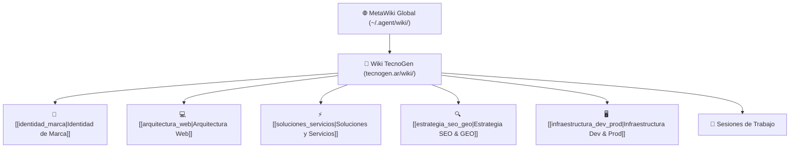

# 🚀 TecnoGen (`tecnogen.ar`) — Documentación Central

> **Tecnología e inteligencia para hacer crecer negocios.**  
> *Marketing + IA + Automatización*  
> Concepto institucional: *Ideas inteligentes para un mayor mañana.*

---

## 🏛️ Estructura del Conocimiento

---

## 📚 Nodos de Conocimiento

| Nodo | Descripción | Estado |
|:-----|:------------|:-------|
| [[identidad_marca\|Identidad de Marca]] | Manual de marca, isotipo TG, paleta cromática, tipografías y tono de voz | ✅ Completo |
| [[arquitectura_web\|Arquitectura Web]] | Estructura frontend, diseño de componentes, sistema de diseño CSS y rendimiento | ✅ Completo |
| [[soluciones_servicios\|Soluciones y Servicios]] | Los 6 pilares comerciales, flujos y arquitectura de conversión | ✅ Completo |
| [[estrategia_seo_geo\|Estrategia SEO & GEO]] | Datos estructurados Schema.org, entidades, optimización para motores de IA | ✅ Completo |
| [[infraestructura_dev_prod\|Infraestructura Dev & Prod]] | Servidores Dev (Hostinger VPS `72.62.107.109`), Prod (Ploi `errante`), puertos y túneles SSH | ✅ Completo |

---

## 📅 Historial de Sesiones

- [[2026-09-24-inicializacion-web-tecnogen\|2026-09-24: Inicialización del Proyecto y Desarrollo del Sitio Web Oficial]]

---

## 🔗 Fuentes y Conexiones

- [[sources\|Fuentes de Verdad & Infraestructura]]: Registro de servidores, puertos y endpoints.
- [[log\|Bitácora de Cambios]]: Registro cronológico de actividades.
- **MetaWiki Global:** [~/.agent/wiki/index.md](file:///home/mfmujic/.agent/wiki/index.md)
- **Visualizador de Grafo 3D:** Puerto `5190` ([http://localhost:5190](http://localhost:5190))
