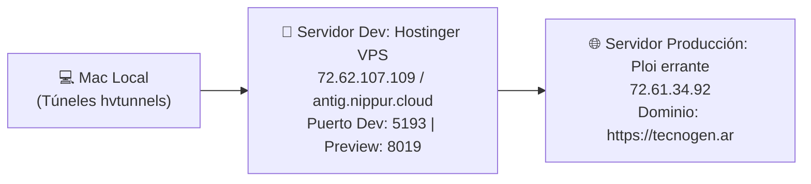

# 🖥️ Infraestructura Dev & Producción — TecnoGen

## 🗺️ Topología de Servidores



---

## 📊 Especificación de Puertos

| Puerto | Protocolo | Servicio | Entorno |
|:-------|:----------|:---------|:--------|
| **5193** | HTTP | Vite Web Dev Server (`tecnogen.ar`) | Hostinger VPS (Dev) |
| **8019** | HTTP | Web Preview / Production Build Server | Hostinger VPS (Dev) |
| **5190** | HTTP | MetaWiki Global Visualizador 3D | Hostinger VPS (Dev) |
| **443** | HTTPS | Nginx SSL Production Server | Ploi `errante` (`72.61.34.92`) |

---

## 🌉 Script de Túneles (`hvtunnels.sh`)

Mapea puertos remotos del VPS hacia `localhost` en la máquina local:
```bash
-L 5193:localhost:5193 \
-L 8019:localhost:8019 \
```
Acceso en navegador: `http://localhost:5193`
