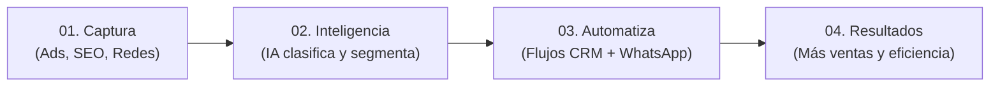

# ⚡ Soluciones y Servicios TecnoGen

TecnoGen no vende "herramientas sueltas", sino **sistemas de crecimiento empresarial** estructurados en 6 grandes soluciones:

---

## 01 — Marketing Digital de Alto Rendimiento
- **Mensaje:** *Conseguimos que las personas correctas encuentren, conozcan y contacten tu empresa.*
- **Alcance:** Google Ads, Meta Ads (Instagram/Facebook), LinkedIn Ads B2B, diseño de funnels, landing pages de alta conversión, analítica avanzada, remarketing segmentado y optimización de tasa de conversión (CRO).

---

## 02 — SEO y Posicionamiento Transaccional & GEO
- **Mensaje:** *Construimos visibilidad orgánica que sigue generando oportunidades incluso cuando dejás de pagar por cada clic.*
- **Alcance:** SEO técnico, arquitectura de contenidos, SEO local y Google Business Profile, keyword research de intención de compra, optimización GEO para motores de IA (ChatGPT, Google AI Overviews, Perplexity).

---

## 03 — Inteligencia Artificial Aplicada a Negocios
- **Mensaje:** *Encontramos dónde la IA puede ahorrar tiempo, mejorar decisiones y generar nuevas oportunidades comerciales.*
- **Alcance:** Agentes autónomos de IA, asistentes de ventas y soporte 24/7, modelos RAG con bases de conocimiento privadas de la empresa, clasificación semántica de consultas y analítica predictiva.

---

## 04 — Automatización de Procesos y Flujos
- **Mensaje:** *Hacemos que procesos que hoy dependen de tareas manuales funcionen automáticamente y sin fricción.*
- **Alcance:** Automatización de flujos de leads, sincronización de bases de datos, generación y envío automático de cotizaciones/documentos, alertas y webhooks entre CRM, WhatsApp, correo y sistemas internos.

---

## 05 — CRM, WhatsApp & Procesos Comerciales
- **Mensaje:** *Desde que entra una consulta hasta que se convierte en cliente fidelizado.*
- **Alcance:** Implementación y consultoría de CRM (Kommo, HubSpot, etc.), WhatsApp Cloud API oficial, bots conversacionales inteligentes, scoring de prospectos, derivación automática al equipo de ventas y trazabilidad total.

---

## 06 — Contenido e IA Generativa (Content OS)
- **Mensaje:** *Un sistema operativo de contenidos para posicionar autoridad y alimentar todos los canales de forma constante.*
- **Alcance:** Workflow integral (*Idea → Estructura → Copy → Identidad Visual → Aprobación → Publicación*), creación de carruseles, artículos de autoridad, reels/videos con IA, guiones y calendarios editoriales automatizados.

---

## 🔄 El Flujo "De la Idea al Resultado"

